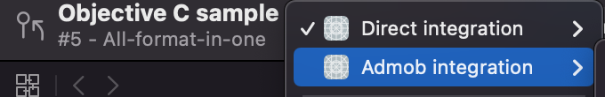

# Ogury Integrations Sample Apps

Here you can find integration samples for Ogury Ads and Ogury Choice Manager SDKs.

## Available Sample Apps
Direct Integration:
- [x] Interstitial
- [x] Opt-In Video
- [x] Thumbnail
- [x] Banner & MPU

Google AdMob Integration:
- [x] Interstitial
- [x] Opt-In Video
- [x] Thumbnail
- [x] Banner


## Requirements
- iOS 15.0+
- Xcode 13+

## Installation

1. [CocoaPods](https://cocoapods.org) is a dependency manager for Cocoa projects. For usage and installation instructions, visit their website.
 Before running the project you have to install the cocoapods dependecy to the project by running bellow command using terminal in root folder of desired Sample App (Swift or Objective C)

```bash
pod install
```


2. In your project workspace, choose the corresponding integration sample schema




3. (Optional) Use your own keys/ad units

    - Replace the bundle identifler in your project target
    - Replace constants inside the Constants.swift or Constant.m file


## Documentation
For a complete documentation for Ogury Choice Manager and each type of ad please visit [https://docs.ogury.co](https://docs.ogury.co)

## Release Notes
Release notes for Ogury SDK can be found at : [https://docs.ogury.co/release-notes/ios](https://docs.ogury.co/release-notes/ios)

## Support
If you need help please checkout [https://help.publishers.ogury.co/hc/en-us](https://help.publishers.ogury.co/hc/en-us)
